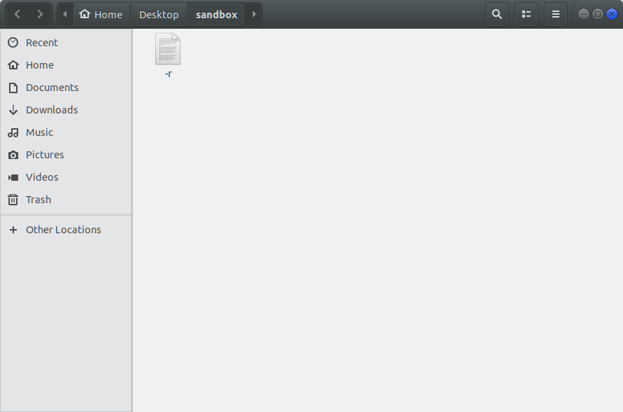

[&#129052; Back](README.md)

# Linux Challenge of the Day

**Question:** How would you remove a file called "-r" in Linux?

**Answer:** `rm ./-r`

Just `rm -r` won't work. Same goes for creating the file: `touch ./-r`.
